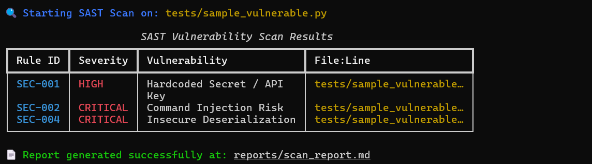
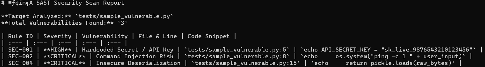
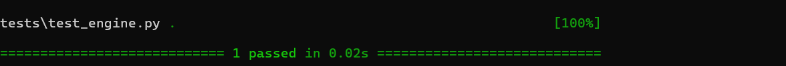
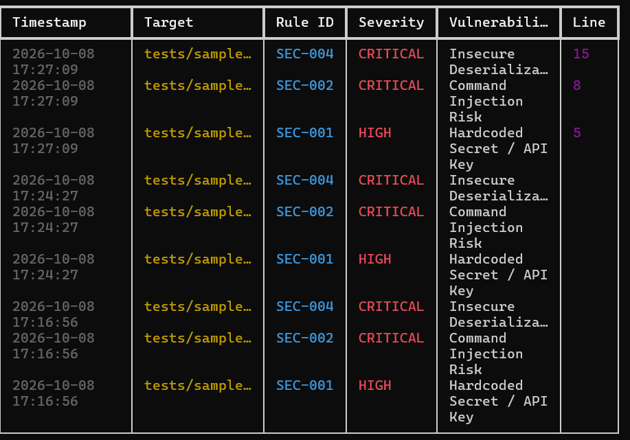

# SAST Security Analyzer

A modular, terminal-based Static Application Security Testing (SAST) tool built in Python to scan codebases for security vulnerabilities.

## Features

- **Regex Rule Engine**: Scans code for Hardcoded Secrets, Command Injection, SQL Injection, and Insecure Deserialization.
- **Terminal UI**: Styled CLI table outputs built with `click` and `rich`.
- **Automated Reporting**: Generates Markdown security reports under `reports/`.
- **Tested**: Automated test suite powered by `pytest`.
- **Containerized**: Production-ready `Dockerfile` for isolated scanning environments.

## Installation & Setup

```bash
git clone https://github.com/rajeshgurindapalli15-crypto/sast-security-analyzer.git
cd sast-security-analyzer
python -m venv venv
venv\Scripts\activate
pip install -r requirements.txt
```
## Diagnostic CLI Execution & Data Presentation

To execute a static code analysis and render intercepted vulnerability vectors in real time, the scanning utility is invoked via the terminal. Below is the active CLI execution and structured table representation rendered via `rich`:



## Automated Compliance Report Artifact

Upon completing the analysis, the engine automatically compiles and exports a standardized security audit document. Below is the raw content structure of the generated report stored within the `reports/` directory:



## Test Harness Execution & Engine Verification

To maintain code reliability and validate matching criteria across regex rule sets, an automated test suite is integrated. Below is the console output confirming successful test execution via `pytest`:



## Historical Scan Logging & Audit Trail

To maintain a chronological history of security assessments, the analyzer logs each scan event with exact timestamps, targeted files, triggered rule IDs, and specific vulnerability line numbers. Below is a structured view of the audit trail captured during test runs:




